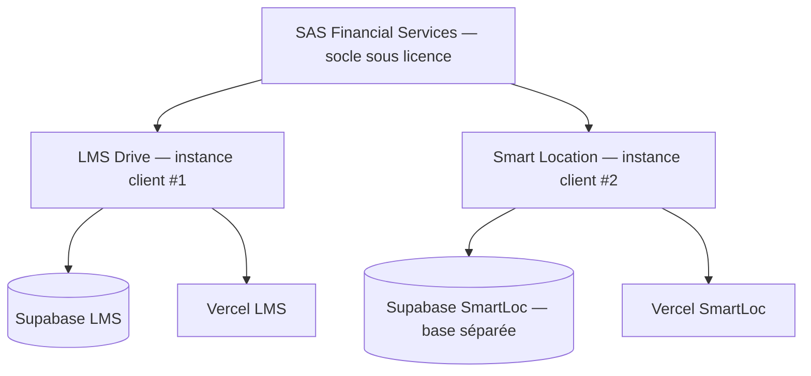

# Plan d'architecture — Adoption shadcn/ui (LMS Drive)

Phase 0 de la mission. Aucun code applicatif modifié. Ce document établit l'état
réel du terrain et le découpage des phases avant toute migration.

## 1. État réel du terrain (l'audit change le cadrage)

Le point de départ n'est pas une migration depuis zéro : **shadcn/ui est déjà
installé et partiellement adopté**. La mission initiale supposait un socle à
migrer entièrement — la réalité est une adoption incomplète à compléter.

- **Stack** : Next.js 16.2.7 (App Router, RSC), React 19.2.4, Tailwind **v4**
  (`@import "tailwindcss"`, config par CSS, pas de `tailwind.config.js`),
  npm, Node v24. Compatible.
- **shadcn présent** : `components.json` (style `default`, baseColor `slate`,
  `cssVariables: true`, `rsc: true`), primitives Radix installées (dialog,
  dropdown-menu, popover, select, switch, tabs, toast, checkbox, avatar,
  separator, label, slot), `sonner`, `class-variance-authority`, `clsx`,
  `tailwind-merge`, `lucide-react`.
- **Composants shadcn déjà générés** dans `components/ui/` : `button`, `card`,
  `input`, `select`, `badge`, `label`, `popover`, `textarea`, `sonner`.
- **Composants maison** cohabitant : `BackButton`, `DeleteButton`, `Toggle`,
  `SmartSearch`, plus des drawers/modales custom (`components/Drawer.tsx`,
  `components/vehicle-schema/DamageDrawer.tsx`) et ~8 modales `fixed inset-0`
  dans les écrans (Documents, Incidents, Due-dates, Internal-trips…).

### Le vrai problème : la couche de tokens shadcn est incomplète
Les composants shadcn référencent les tokens standards (`bg-primary`,
`text-primary-foreground`, `bg-destructive`, `border-input`, `bg-background`,
`ring-ring`, `bg-secondary`, `bg-accent`). Or `app/globals.css` ne définit
**aucun** de ces tokens : il porte un design system maison (`--bg`,
`--text-primary`, `--accent`, `--green/orange/red/blue`) et ne mappe dans
`@theme inline` que `--color-background` et `--color-foreground`. En Tailwind
v4, `bg-primary` attend `--color-primary` — non défini. Les composants shadcn
ne reçoivent donc pas la marque et retombent sur des valeurs par défaut. **La
première brique de tout le reste est de compléter cette couche de tokens.**

## 2. Inventaire composant par composant → cible shadcn

| Écran / brique actuelle | État | Cible shadcn |
|---|---|---|
| `ui/button`, `ui/card`, `ui/input`, `ui/select`, `ui/badge`, `ui/textarea`, `ui/label`, `ui/popover` | shadcn, mais tokens non câblés | Recâbler via tokens (Phase 1) |
| `ui/sonner` | présent, à généraliser | Sonner comme système de toast unique |
| `ui/Toggle` (maison) | custom | `switch` (Radix déjà installé) |
| `ui/DeleteButton` (confirm maison) | custom | `alert-dialog` |
| `components/Drawer.tsx`, `DamageDrawer.tsx`, modales `fixed inset-0` | custom | `dialog` + `sheet` (drawer mobile via `vaul`) |
| Onglets Documents / Réglages (maison) | custom | `tabs` (Radix installé) |
| Menus d'actions (statuts, lignes) | custom | `dropdown-menu` (Radix installé) |
| « Chargement… » / `.skeleton` | texte/bloc statique | `skeleton` |
| Listes réservations / flotte / compta | tables maison | `data-table` (TanStack — à installer) |
| Recherche (`SmartSearch`) | maison | `command` (palette ⌘K — `cmdk` à installer) |
| Sélecteurs de date (réservations) | `<input type=date>` | `calendar` + `popover` (date-fns déjà là) |

Restent **custom, non migrés** (aucun équivalent shadcn propre) : le **système
polygonal EDL** (`VehicleInspectionMap`, zones) et le **calendrier
multi-ressources**. On ne les force pas dans shadcn.

Primitives Radix installées mais **sans wrapper `.tsx`** encore généré, à ajouter
via `npx shadcn@latest add` : `dialog`, `alert-dialog`, `sheet`, `tabs`,
`switch`, `dropdown-menu`, `checkbox`, `avatar`, `separator`, `skeleton`,
`tooltip`. À installer en plus (dépendances absentes) : `vaul` (drawer),
`cmdk` (command), `@tanstack/react-table` (data-table).

## 3. Table des tokens — actuel (maison) → cible shadcn

Objectif : rendu **iso-visuel** (noir/blanc, mêmes accents). On garde les vars
maison comme source et on ajoute les tokens shadcn qui pointent dessus.

| Token shadcn | Valeur actuelle (source maison) |
|---|---|
| `--background` | `#FFFFFF` (`--bg`) |
| `--foreground` | `#111111` (`--text-primary`) |
| `--card` / `--popover` | `#FFFFFF` |
| `--card-foreground` / `--popover-foreground` | `#111111` |
| `--primary` | `#111111` (`--accent`, le noir logo) |
| `--primary-foreground` | `#FFFFFF` |
| `--secondary` | `#F8F9FA` (`--bg-secondary`) |
| `--secondary-foreground` | `#111111` |
| `--muted` | `#F1F1F1` (`--bg-tertiary`) |
| `--muted-foreground` | `#6B7280` (`--text-secondary`) |
| `--accent` | `#F1F1F1` |
| `--border` / `--input` | `#E5E7EB` (`--border`) |
| `--ring` | `#111111` |
| `--destructive` | `#DC2626` (`--red`) |
| `--radius` | `0.75rem` (arrondis actuels `rounded-2xl/xl`) |

Couleurs fonctionnelles conservées telles quelles (`--green #16A34A`,
`--orange #D97706`, `--blue #2563EB`, `--badge-red #EF4444`).

## 4. Découpage des phases

- **Phase 1 — Couche de tokens (LÉGER, 1-2 fichiers).** Compléter `globals.css`
  avec le bloc de tokens shadcn (table §3), câbler `@theme inline`. Vérifier que
  `button`/`card`/`input`/`badge` rendent bien les couleurs LMS d'origine.
  Point de bascule : rien de visible ne doit changer.
- **Phase 2 — Primitives manquantes + remplacement du custom (MOYEN).** Générer
  `dialog`, `alert-dialog`, `sheet`, `tabs`, `switch`, `dropdown-menu`,
  `skeleton`, `tooltip`. Remplacer, un groupe à la fois : `Toggle`→`switch`,
  `DeleteButton`→`alert-dialog`, drawers/modales→`dialog`/`sheet`, onglets→`tabs`,
  « Chargement… »→`skeleton`. Commit atomique par groupe, diff validé à chaque
  fois. Iso-fonctionnel strict.
- **Phase 3 — Briques « app pro » (MOYEN/LOURD).** Ajouts à vraie valeur UX :
  `command` (palette ⌘K de recherche globale réservations/véhicules/clients),
  `sheet`+`vaul` pour le tiroir calendrier et le panneau SAV en bottom-sheet
  fluide, `data-table` (TanStack) sur les grandes listes. Module par module.
- **Phase 4 — Polish & cohérence (LÉGER).** `tooltip`, `avatar`, `separator`,
  états vides, focus-rings, transitions. Passe finale de cohérence visuelle.

## 5. Volet duplication Smart Location (rappel mission, hors périmètre immédiat)

La duplication vers Smart Location reste une phase ultérieure et distincte : une
fois shadcn complété sur LMS Drive, on duplique le repo migré (sans historique
git ni `.env`), rebrandé noir/blanc/doré, sur une base Supabase séparée. Schéma
réseau cible :

Ce volet fera l'objet de sa propre validation ; il n'est pas traité tant que
l'adoption shadcn sur LMS Drive n'est pas stabilisée.

## Prérequis avant la Phase 1 (code)
- **Arbre git à nettoyer** : modifications hors-mission non commitées
  (`DocumentsClient.tsx`, `lib/upload.ts`, `next.config.ts`, `CLAUDE.md`,
  `.claude/settings.json`) — à commiter/stasher avant de coder.
- **Branche dédiée** `feat/shadcn-migration` à créer pour toute la Phase 1+.
- `components.json` pointe vers un `tailwind.config.js` inexistant (Tailwind v4) —
  à corriger pour que `npx shadcn add` fonctionne.
